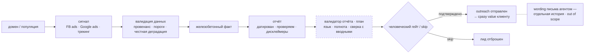

# Client discovery — линейка принятия решений

Сигнал → валидация данных → железобетонный факт → отчёт → **валидатор отчёта** →
человеческий гейт → outreach. Простая лестница; может разрастись агентами, но логика
подчинения та же.

> **Валидатор отчёта** (узел пунктиром) — *планируется, в коде ещё нет*: проход
> Python / агент → Python, который перед отправкой сверяет отчёт с вводными и сам с
> собой (счётчики, дисклеймеры, язык креативов, совпадение бренда). Агент флагует —
> детерминированное правило решает пас/стоп.
>
> **Out of scope этого блока:** wording самого письма генерит агент — это отдельная
> история. Здесь фиксируем только, что из гейта наружу уходит *валидированный* факт.
