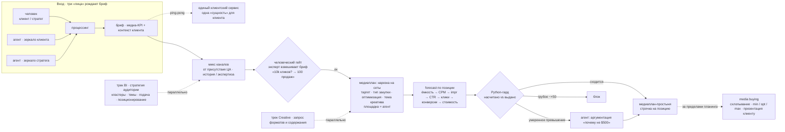

# Planning — линейка принятия решений

Вход — три «лица» (человек клиент/стратег + два агента-зеркала: клиента и стратега)
сводят один бриф; клиент общается с этим как с единым сервисом. Дальше: микс каналов →
человеческий гейт (эксперт сверяет бриф с бизнес-целью) → построение плана (площадка =
агент) → forecast по позиции → Python-гард по бюджету → медиаплан-простыня. Параллельно
идут треки BI (аудитория) и Creative. Схлопывание простыни, опции бюджета и презентация
клиенту — уже media buying, за пределами этого блока.

> **Весь блок — спроектирован, в коде ещё нет.** Диаграмма показывает задуманную линейку
> подчинения, не работающий пайплайн.
>
> **Python-гард (бюджет)** — единственный названный детерминированный guardrail: сверяет
> насчитанный бюджет с выданным; умеренное превышение → требует аргументацию, грубое
> (~×50) → блок. Это kill-switch стадии в коде.
>
> **Человеческий гейт** — эксперт ловит подмену прокси-метрики бизнес-целью («10k кликов»
> → «100 продаж») до того, как строится план.
>
> **Параллельные треки** (пунктир) — BI (стратегия аудитории) и Creative (форматы и
> содержание) питают планинг сбоку, не задерживая основную линейку.
>
> **За пределами блока** (пунктир направо): схлопывание каналов в общую простыню, опции
> бюджета min / opt / max и презентация клиенту отнесены к media buying — отдельному шагу
> после планинга.
