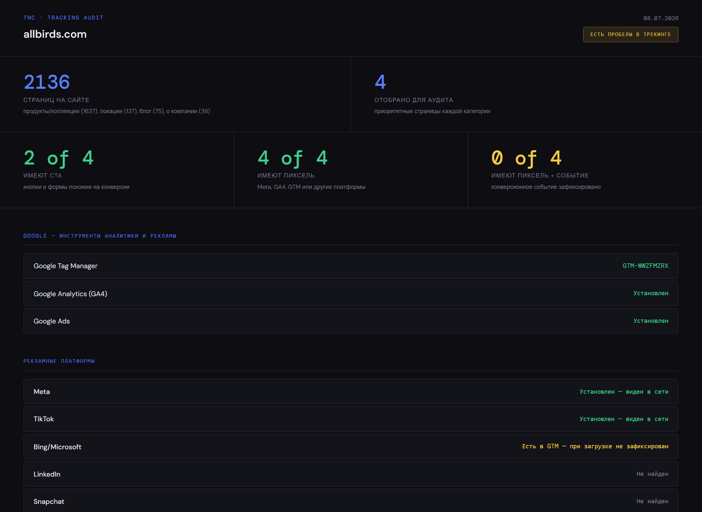
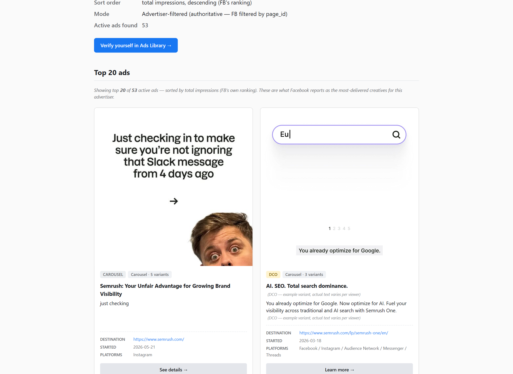

# Marketing Agent Pipeline

An ad agency, rebuilt as a pipeline of single-task agents: agents for judgment, Python for the load-bearing decisions, and an LLM that never touches money.

## Who I am and why this exists

I'm a performance marketer, 12+ years in. At my day job I manage about $600K/month of Meta ad spend solo. On the side I run a small agency, TNC. This repo is that agency's workflow rebuilt as software — my real working tool, not a portfolio prop.

Why a pipeline and not a swarm: coordination is where multi-agent systems break. So agents here never talk to each other. Each does one narrow job and hands a finished product to the next, and at every handoff there is deterministic code or a human. Everything expressible as a rule — math, limits, reconciliation — is written in code once and pinned by tests. The agent is reserved for what is genuinely judgment.

## Stage 01 — what works today

Stage 01 is a tracking-audit scanner. Point it at a domain, or a list of domains. It:

- maps the site, detects the platform (Shopify / WordPress / Webflow / generic), and classifies every URL;
- opens pages in a real browser (Playwright), intercepts pixel traffic, and checks whether Meta Pixel, GA4, and GTM actually fire — simulating the user journey (Add to Cart, checkout) because many events only fire on action, and stopping before any real payment;
- labels every page **OK** (pixel present, conversion event fired), **GAP** (pixel present, event doesn't fire), or **NO-TRACKING** (no pixels at all). The three statuses never mix in a report.

The qualifying logic is blunt: a business that spends on ads but tracks them wrong is a tier-1 lead. They have budget, they have a concrete problem, and I can name it before the first call.


*A real run on allbirds.com: 2,136 pages mapped, pixels present on every audited page — and zero conversion events firing. That last number is the product.*

Then it looks at the competition:

- **Facebook Ad Library** — finds the brand's page, counts active ads, pulls creatives with a provenance tag on how each match was made (exact page ID vs fuzzy name match, with the confidence stated in the report);
- **Google Ads Transparency Center** — domain → advertisers → creatives, with ad text and impression ranges. The recorded dataset: **2,244 creatives across 10 domains**, 96% with usable text or image.


*Competitor intelligence on semrush.com: top ads by Facebook's own impression ranking, format and variant tags on every card — and a "verify yourself in Ads Library" link, because every fact in the report must be checkable by the reader.*

On top of both sits a pitch-adviser that estimates a competitor's ad spend from public reach data (reach × frequency × CPM benchmarks). The estimate is always labeled an estimate, never a fact.

The output is a report you can send to a prospect as a first touch. Every fact in it is dated, tagged with how it was obtained, and linked to the public source so the reader can verify it themselves.

## The trust ladder

An agent earns the right to act. It doesn't get it by default:

1. **Backtest** — run on historical data where the right answer is known.
2. **Shadow mode** — runs alongside a human; decisions are compared, never applied.
3. **Human-in-the-loop** — the agent decides, a person confirms every decision.
4. **Bounded autonomy** — acts alone inside a narrow corridor; stepping outside triggers automatic rollback.

One invariant holds across the whole pipeline: **the agent never deletes anything — it only pauses or archives.** The prior state is always kept, so every action is reversible. Without that there is no audit and no rollback.

## How do I know the AI works

Because I measure it on a frozen test bench, not by feel.

The golden corpus is **12 real domains** (allbirds.com, gymshark.com, fritz-kola.de, nissan.ie, and others) with human-verified expected results. The expected file records what the scanner *must* see on that site — verified by hand, against independent recordings of the raw pixel traffic — not whatever the scanner happens to output today.

Every change reruns the corpus through `eval_run.py`, which scores each check **MATCH / FAIL / DRIFT**. DRIFT means the live site changed, not the scanner — the two are told apart by raw network evidence. The score history is committed to `history.csv`: a trust curve anyone can read in the repo. The latest full run scores 701 of 715 checks (98%); the misses are named, known failures being fixed, not mysteries.

"Does the AI work?" is a number here, with a paper trail.

## Exactly one LLM call

The working pipeline contains exactly one LLM call, fenced by deterministic code on both sides.

Classifying a URL's meaning ("is this a checkout page or a blog post?") is judgment, so it goes to an agent — but only as the last rung of a ladder: learned patterns (`patterns.json`, grown through manual approval) → regex rules → Claude Haiku, in batches of 50, only for URLs the first two rungs didn't recognize. What to *do* with the label — which conversion events to expect on that page type — is decided by a deterministic table after the agent.

Every classification carries a provenance tag: `method=patterns_json`, `regex`, or `claude`. You can always see whether a rule or a model made the call. And with no API key the tool doesn't fall over: the Claude rung is skipped, unrecognized URLs degrade to a safe default, and the log says so plainly.

## What's real and what's design

I'd rather understate this than dress it up:

| Stage | What it does | Maturity |
|---|---|---|
| **01 — Client discovery** | tracking audit + competitor intelligence | **working tool, months of real runs** |
| 02 — Planning | split a brief into Python-checkable vs judgment | design document |
| 03 — Execution | scale / kill / hold on live ad budgets | design + stub decision engine, not live |
| 04 — Reporting | segments and cohorts, not averages | outline |
| 05 — Integration | all stages as one runnable flow | outline |

The stage-03 stub ([`policy.py`](03-execution/engine/policy.py)) runs on mock data and shows the shape of the money logic: three sequential gates — an innocence check before any kill (is the bad CPA really the ad's fault, or attribution lag, a broken site, an out-of-stock anchor product?), a learning-phase hold, then scale/kill with a +20%-per-step cap. Money would move only through deterministic gates, each decision written to an audit log. It has never touched a real account, and it says so on every page.

## Politeness policy

The scanner reads public data only. Ad Library and the Transparency Center are transparency tools — Meta and Google built them precisely for public consultation.

For the sites themselves: plain request first. A 429 means we're going too fast — pause, retry once. A 403 means we look like a bot — retry once with a real browser. If that fails, the page is marked "could not read" and the report recommends checking by hand. Whether a site lets us in is decided once, at the front door; any failed request after that is a fact about our tooling, never a verdict about the site. "Could not read" never becomes "has no tracking."

No stealth plugins, no residential proxies, no CAPTCHA solvers — explicitly out of scope, by design. An honest "we couldn't reach it" is worth more to a client than a guessed number.

## Hygiene

No secrets in git history: API keys live in environment variables only, and the full history has been audited to confirm it.

## Quickstart

```bash
pip install -r requirements.txt
playwright install chromium        # required for the browser scan
cd 01-client-discovery/engine
python step1_sitemap.py <domain>                            # sitemap, platform, ads, classification
python step2_scan.py scans/<domain>/<domain>_step1.json     # browser scan: pixels, events, CTAs
python report.py scans/<domain>/<domain>_step2.json         # report
```

Set `ANTHROPIC_API_KEY` for full URL classification. Without it the tool still runs — the Claude rung is skipped and results are coarser. Details: [`01-client-discovery/engine/README.md`](01-client-discovery/engine/README.md).

## A note on language

This is a live working repo, and its working language is Russian: code comments, commit message bodies, and some internal docs. Everything a visitor needs first is in English — this README, the stage READMEs, the engine and golden-corpus docs — with the Russian originals kept next to them as `*.ru.md`. The original Russian essay this README adapts is in [README.ru.md](README.ru.md).
