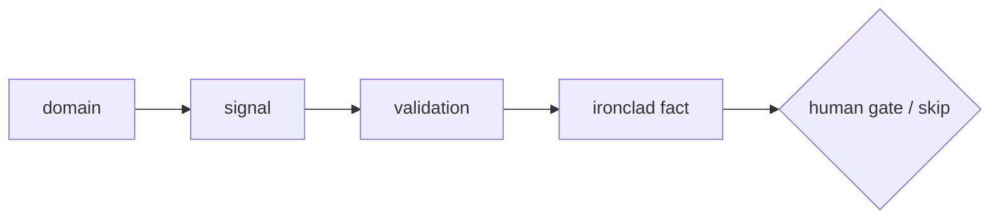

# Client discovery — decision flow

*[Mermaid diagram, filled in Step 3. Keep it a simple left-to-right ladder:
signal → validation → ironclad fact → gate. No deep nesting. GitHub renders Mermaid
natively — nothing to install.]*

