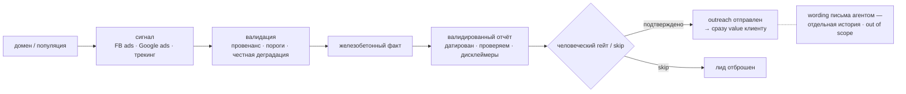

# Client discovery — линейка принятия решений

Сигнал → валидация → железобетонный факт → валидированный отчёт → человеческий гейт →
outreach. Простая лестница; может разрастись агентами, но логика подчинения та же.

> **Out of scope этого блока:** wording самого письма генерит агент — это отдельная
> история. Здесь фиксируем только, что из гейта наружу уходит *валидированный* факт.
