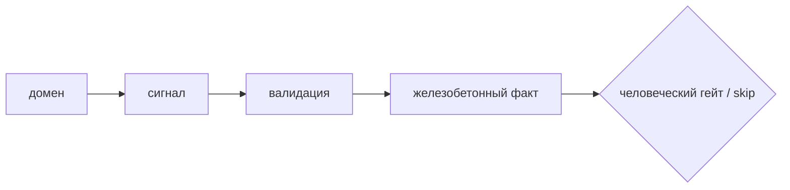

# Client discovery — линейка принятия решений

*[Mermaid-диаграмма, наполняется на Шаге 3. Держать простой лестницей слева-направо:
сигнал → валидация → железобетонный факт → гейт. Без глубокой вложенности. Со сноской,
что флоу может разрастись агентами. GitHub рендерит Mermaid нативно — ставить ничего не
нужно.]*

