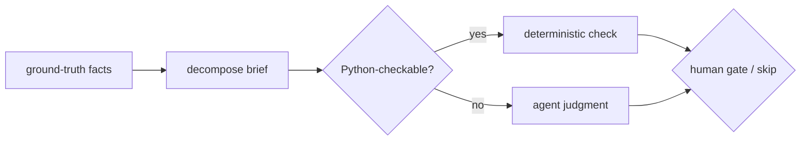

# Planning — decision flow

*[Mermaid diagram, filled in Step 4. Same simple left-to-right style as 01:
brief → decomposition → Python-check vs agent-judgment → gate.]*

```mermaid
%% placeholder — replaced in Step 4
flowchart LR
  A[ground-truth facts] --> B[decompose brief]
  B --> C{Python-checkable?}
  C -->|yes| D[deterministic check]
  C -->|no| E[agent judgment]
  D --> F{human gate / skip}
  E --> F
```
