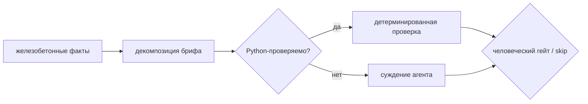

# Planning — линейка принятия решений

*[Mermaid-диаграмма, наполняется на Шаге 4. Тот же простой стиль слева-направо, что в 01:
бриф → декомпозиция → Python-проверка vs агентское суждение → гейт.]*

